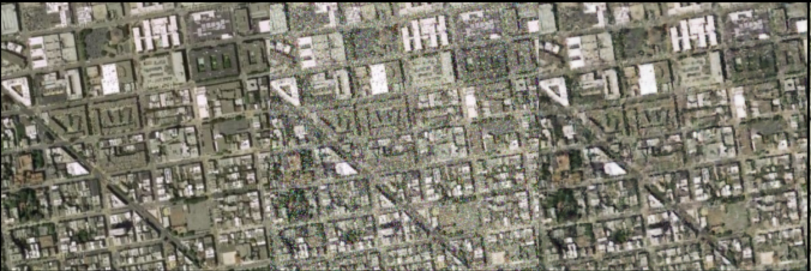

# WGAN-Based Aerial Image Denoising

## Introduction

This project implements a Wasserstein Generative Adversarial Network (WGAN) with gradient penalty and a perceptual loss term to denoise aerial imagery. Noisy inputs are passed through a U‑Net–inspired generator that learns to reconstruct clean images, while a patch‑based discriminator enforces realism via the Wasserstein loss. We further incorporate an L1 reconstruction loss and a VGG‑based perceptual loss to preserve fine textures and structural details.

## Dataset

Our training set is a combination of four publicly available aerial scene datasets. For each, we introduced 10%–15% noise of three types (random, multiplicative, and Gaussian) and then combined them:

| Dataset      | Random Noise Files | Multiplicative Noise Files | Gaussian Noise Files |
|--------------|--------------------|----------------------------|----------------------|
| UC‑Merced    |                    |                            |                      |
| WHU‑RS19     |                    |                            |                      |
| RSSCN7       |                    |                            |                      |
| AID          |                    |                            |                      |
-----------------------------------------------------------------------------------------
1. [UC‑Merced dataset](http://vision.ucmerced.edu/datasets/landuse.html), contains 21 scene classes and 100 samples of size 256×256 in each class.  
2. [WHU‑RS19 dataset](http://dsp.whu.edu.cn/cn/staff/yw/HRSscene.html), has 19 different scene classes and 50 samples of size 600×600 in each class.  
3. [RSSCN7 dataset](https://sites.google.com/site/qinzoucn/documents), contains 7 scene classes and 400 samples of size 400×400 in each class.  
4. [AID dataset](https://captain-whu.github.io/AID/AIDscene.html), has 30 different scene classes and about 200 to 400 samples of size 600×600 in each class.  

> **Note:** You can replace these dummy names/links with any other aerial datasets as needed.

## Model Explanation

### Generator

- **Architecture:** U‑Net–like encoder–decoder with skip connections.  
  - **Downsampling path:** Four `DownSample` blocks (3→64, 64→128, 128→256, 256→512) each followed by 2×2 max‑pooling.  
  - **Bridge:** One `UpSample` block expanding 512→1024 feature maps.  
  - **Upsampling path:** Four transpose‑convolutions interleaved with `UpSample` blocks, concatenating encoder features at each scale.  
  - **Output:** 3‑channel image via a final `Conv2d(64→3)` and a `Tanh` activation.

### Discriminator

- **PatchGAN‑style:** Takes a concatenation of noisy and (real or generated) images (6 channels) and outputs a feature map of “realism” scores.  
- **Layers:**  
  1. Conv(6→64, 4×4, stride=2) + ReLU  
  2. Conv(64→128, 4×4, stride=2) + BatchNorm + ReLU  
  3. Conv(128→256, 4×4, stride=2) + BatchNorm + ReLU  
  4. Conv(256→512, 4×4, stride=1) + BatchNorm + ReLU  
  5. Conv(512→1, 4×4, stride=1)  

### Loss Functions

1. **Wasserstein GAN loss with gradient penalty (WGAN‑GP):**  
   \[
   \mathcal{L}_D = \mathbb{E}[D(x_{\text{fake}})] - \mathbb{E}[D(x_{\text{real}})] + \lambda_{\text{gp}}\,\mathbb{E}\big[(\|\nabla_{\hat{x}} D(\hat{x})\|_2 - 1)^2\big]
   \]  
   \[
   \mathcal{L}_G^{\text{adv}} = -\,\mathbb{E}[D(x_{\text{fake}})]
   \]

2. **Reconstruction loss:** L1 loss between generated and clean images, weighted by 100.  
3. **Perceptual loss:** L1 loss on feature maps of a pre‑trained VGG‑19 (first 16 layers), weighted by 0.1.  
4. **Total generator loss:**  
   \[
   \mathcal{L}_G = \mathcal{L}_G^{\text{adv}} + 100\,\mathcal{L}_{\text{L1}} + 0.1\,\mathcal{L}_{\text{perc}}
   \]

## Results

Below is an example comparison of **Real Clean**, **Noisy Input**, and **Denoised Output**:

  

- **PSNR:** 33.04 dB  
- **SSIM:** 0.9172

